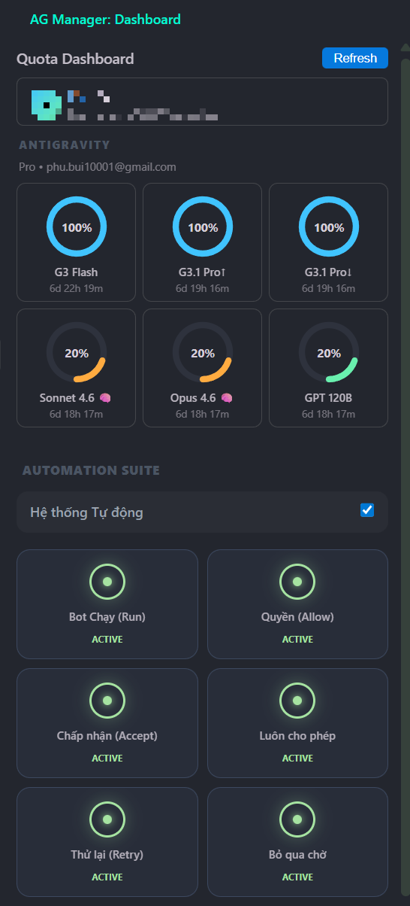
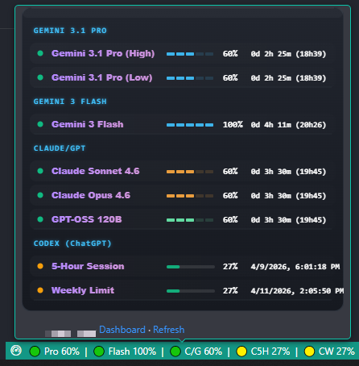

# AG Manager (Antigravity & AI Quota Manager)

[English Below]

**AG Manager** là tiện ích tối ưu dành cho người dùng **Antigravity IDE**, giúp bạn giám sát và quản lý hạn mức sử dụng (quota) của tất cả các dịch vụ AI hàng đầu ngay trong tầm tay.

---

**AG Manager** is the ultimate extension for **Antigravity IDE** users, helping you monitor and manage AI model quotas for all leading services at your fingertips.

## 📸 Previews

| Dashboard | Status Bar Popup |
|-----------|------------------|
|  |  |

## 🚀 Tính năng nổi bật / Key Features

### 🇻🇳 Tiếng Việt
- **Dashboard Trực Quan:** Giám sát Gemini và GPT theo thời gian thực (real-time).
- **Cảnh Báo Thông Minh:** Tự động thông báo theo từng nhóm (group) thay vì báo spam từng model riêng lẻ.
- **Automation Suite (Hệ thống tự động):** Cấu hình tự click thông minh, có cơ chế an toàn siêu việt.
- **Tự động làm mới:** Cấu hình quét dữ liệu ngầm tự động (1-30 phút).

### 🇺🇸 English
- **Visual Dashboard:** Real-time monitoring for Gemini and GPT.
- **Smart Notifications:** Group-based alerts to prevent spam when average remaining quota drops below 20%.
- **Automation Suite:** Intelligent background click automation with robust fail-safe mechanism.
- **Background Auto-Refresh:** Configurable background updates (1-30 minutes).

## 🛠 Cấu hình / Settings

- `sqm.refreshInterval`: (Default: 5 mins)
- `sqm.enableNotifications`: (Default: true)

---
*Developed by BiViPi - Optimized for your coding performance.*
